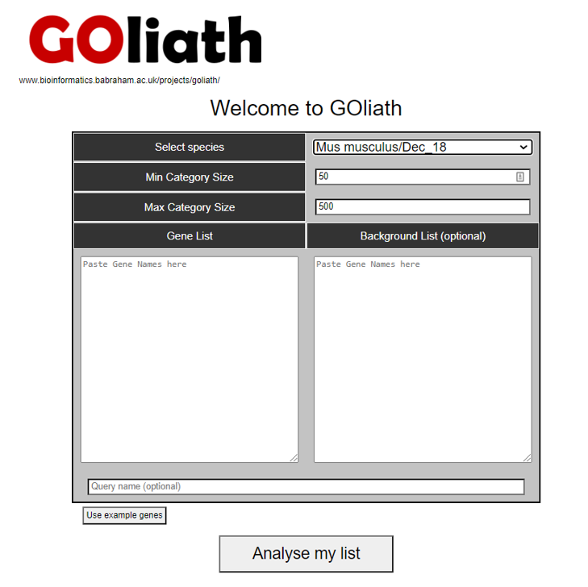

# GOliath
A web based Gene Ontology searching and visualisation system

GOliath performs gene ontology enrichment for mouse or human genes and checks the resulting categories against a set of pre-computed functional categories that may be artefactual or biased. If matches are found, the results are flagged as potentially biased.

